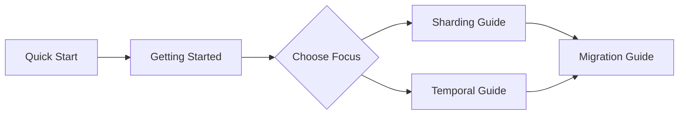

# Guides

Welcome to the DTDE guides! This section contains tutorials to help you get started and become productive with DTDE.

---

## Learning Path

Follow this recommended path to learn DTDE:



---

## Guide Overview

| Guide | Description | Time | Level |
|-------|-------------|------|-------|
| [**Quick Start**](quickstart.md) | Minimal setup to get running | 5 min | Beginner |
| [**Getting Started**](getting-started.md) | Complete introduction to DTDE | 20 min | Beginner |
| [**Sharding Guide**](sharding-guide.md) | All sharding strategies in depth | 25 min | Intermediate |
| [**Temporal Guide**](temporal-guide.md) | Point-in-time queries and versioning | 20 min | Intermediate |
| [**Migration Guide**](migration-guide.md) | Migrate existing EF Core projects | 15 min | Intermediate |

---

## Quick Start (5 minutes)

The fastest way to get DTDE running:

```csharp
// 1. Inherit from DtdeDbContext
public class AppDbContext : DtdeDbContext
{
    public DbSet<Customer> Customers => Set<Customer>();

    protected override void OnModelCreating(ModelBuilder modelBuilder)
    {
        base.OnModelCreating(modelBuilder);

        // 2. Configure sharding
        modelBuilder.Entity<Customer>()
            .ShardBy(c => c.Region);
    }
}

// 3. Register with UseDtde()
services.AddDbContext<AppDbContext>(options =>
    options.UseSqlServer(connectionString)
           .UseDtde(dtde => dtde
               .AddShard(s => s.WithId("EU").WithShardKeyValue("EU"))
               .AddShard(s => s.WithId("US").WithShardKeyValue("US"))));
```

[:octicons-arrow-right-24: Full Quick Start](quickstart.md)

---

## Choose Your Path

### New to DTDE?

1. **[Quick Start](quickstart.md)** - Get running in 5 minutes
2. **[Getting Started](getting-started.md)** - Understand all the concepts
3. **[Sharding Guide](sharding-guide.md)** or **[Temporal Guide](temporal-guide.md)** - Deep dive

### Experienced with EF Core?

1. **[Getting Started](getting-started.md)** - DTDE-specific concepts
2. Jump directly to **[Sharding Guide](sharding-guide.md)** or **[Temporal Guide](temporal-guide.md)**

### Migrating an Existing Project?

1. **[Migration Guide](migration-guide.md)** - Step-by-step migration
2. **[API Reference](../wiki/api-reference.md)** - Detailed API documentation

---

## Related Documentation

- **[API Reference](../wiki/api-reference.md)** - Complete API documentation
- **[Configuration](../wiki/configuration.md)** - All configuration options
- **[Architecture](../wiki/architecture.md)** - System design
- **[Troubleshooting](../wiki/troubleshooting.md)** - Common issues and solutions
- **[Samples](https://github.com/yohasacura/dtde/tree/main/samples)** - Working examples

---

[← Back to Documentation](../index.md) | [Quick Start →](quickstart.md)
